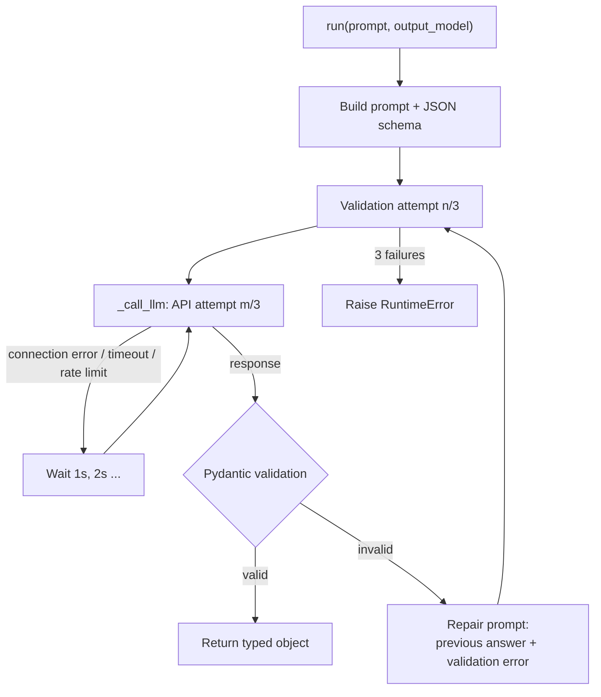

# Structured output agent

An agent that turns free text into typed, validated Python objects. You give it a
prompt and a Pydantic model; it returns an instance of that model or raises an
error. It never returns unchecked LLM output.

Code: [`structured_output_agent/`](../structured_output_agent/)

## Quick example

```python
from app.models import EntityExtraction

entities = agent.run(
    prompt="Extract the entities from this text:\n\n"
           "Sam Altman spoke at an OpenAI event in San Francisco. "
           "Several researchers from Microsoft also attended.",
    output_model=EntityExtraction,
)

entities.people          # ['Sam Altman']
entities.organizations   # ['OpenAI', 'Microsoft']
entities.locations       # ['San Francisco']
```

## How it works



There are two independent retry loops:

| Loop | Handles | Where | Limit |
|---|---|---|---|
| Validation | The model answered, but the answer doesn't match the schema | `run()` | `max_retries` (default 3) |
| API | The request itself failed: server down, timeout, rate limit | `_call_llm()` | `api_retries` (3) |

## Features

### Works with any Pydantic model

The output model is a parameter, not hardcoded. The same agent instance handles
every model in [`models.py`](../structured_output_agent/app/models.py):

| Model | Fields |
|---|---|
| `ArticalAnalysis` | `title`, `summary` (10–500 chars), `sentiment` (positive / negative / neutral), `confidence` (0–1) |
| `EntityExtraction` | `people`, `organizations`, `locations` (lists of strings) |
| `PatientExtraction` | `age` (≥ 0), `gender` (male / female / other), `diagnosis` (5–200 chars) |
| `CodeReview` | `bugs` (list of strings), `severity` (low / medium / high) |

`run()` is typed with a `TypeVar`, so passing `EntityExtraction` returns an
`EntityExtraction`, and your editor autocompletes `entities.people`.

To add a new task, write a new Pydantic model. The agent needs no changes.

### The schema is the prompt

The agent calls `output_model.model_json_schema()` and puts the result in the
prompt. Everything defined on the model reaches the LLM automatically: field
names, types, `description=` text, allowed `Literal` values and limits such as
`min_length` or `ge`/`le`. The model definition and the prompt can't drift apart,
because the prompt is generated from the model.

### Validation: never trust raw output

Every response goes through `output_model.model_validate_json()`, which checks:

- the text is valid JSON
- every required field is present, with the right type
- `Literal` fields hold one of the allowed values
- numbers and strings stay within their limits

### Self-repair on invalid output

When validation fails, the next attempt doesn't just resend the same prompt. It
sends a **repair prompt** with the schema, the model's previous answer and the
exact Pydantic error, so the model can see what it got wrong and fix it.

Example from a test run where the prompt deliberately asked for the wrong
sentiment values:

```
Validation attempt 1/3
  → model answered "sentiment": "sad"
  → literal_error: Input should be 'positive', 'negative' or 'neutral'
Validation attempt 2/3   (repair prompt with the error)
  → model answered "sentiment": "negative"
Validation passed on validation attempt 2
```

### API retries with exponential backoff

`_call_llm()` retries only errors that are worth retrying: `APIConnectionError`,
`APITimeoutError` and `RateLimitError`. It waits 1s, then 2s, between attempts.
Other errors, such as a wrong API key, fail immediately. Tested by pointing the
agent at a port with no server:

```
Calling LLM: API attempt 1/3
API call failed on attempt 1: Connection error.
Retrying API call in 1 seconds
Calling LLM: API attempt 2/3
API call failed on attempt 2: Connection error.
Retrying API call in 2 seconds
Calling LLM: API attempt 3/3
API call failed on attempt 3: Connection error.
API failed after 3 attempts
```

### Fails loudly

If all validation attempts fail, the agent raises `RuntimeError`. If all API
attempts fail, it re-raises the original `openai` error. It never returns `None`,
so calling code can't carry on with a missing result by accident.

### Logging

The agent logs through a module logger (`app.agent`), configured by
`setup_logging()` in [`logging_config.py`](../structured_output_agent/app/logging_config.py).
A normal run:

```
INFO - Running agent: output_model=EntityExtraction model=Qwen3.6-35B-A3B-MLX-8bit thinking=False
INFO - Validation attempt 1/3
INFO - Calling LLM: API attempt 1/3
INFO - LLM responded in 0.8s (308 prompt + 54 completion tokens)
INFO - Validation passed on validation attempt 1
```

| Level | What is logged |
|---|---|
| INFO | Each run, each validation and API attempt, response time and token counts, validation passing |
| WARNING | Validation failures (with the Pydantic error) and failed API calls |
| ERROR | Giving up, just before the exception |
| DEBUG | The full prompt and the model's raw output |

Set `level=logging.DEBUG` in `logging_config.py` to see prompts and raw outputs.

### Config injection

[`main.py`](../structured_output_agent/main.py) is the only file that reads
`.env`. It creates the `OpenAI` client and passes the client, model name and
thinking setting into the agent. The agent itself has no config, so it's easy to
reuse or to run several agents with different settings side by side.

### Thinking mode

`thinking=True` lets Qwen reason before answering: slower, but better for harder
extraction tasks. It is set by `OMLX_THINKING` in `.env` and sent per request as
`chat_template_kwargs.enable_thinking`.

## Project layout

```
structured_output_agent/
├── main.py                # entry point: reads .env, sets up logging, runs examples
└── app/
    ├── agent.py           # StructuredOutputAgent: run() and _call_llm()
    ├── models.py          # Pydantic output models
    └── logging_config.py  # setup_logging()
```

Run it from inside the folder (the `from app...` imports only work there):

```bash
cd structured_output_agent
uv run main.py
```

## Known limitations

- **The repair prompt doesn't include the original input.** It carries the
  previous answer and the error, which is enough to fix a wrong field value. If a
  retry has to redo the extraction itself, the model can't see the text and may
  invent content.
- **Retries stack with the `openai` client's own.** The client retries connection
  errors and rate limits twice by default, so one API attempt can make up to three
  requests. Create the client with `OpenAI(..., max_retries=0)` so that all
  retries are the agent's own and show up in the logs.
- **Context is capped at 32k tokens by the oMLX server** (see
  [omlx-setup.md](omlx-setup.md)), even though the model supports 262k. Long
  inputs need that setting raised.
